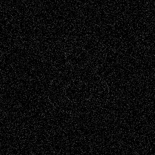
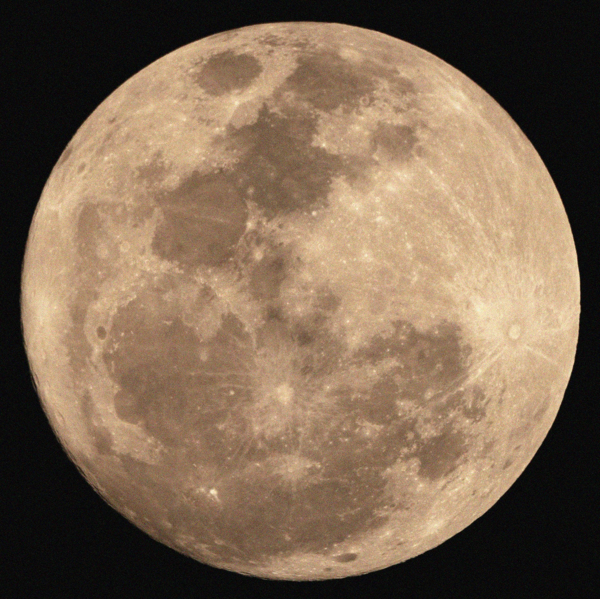
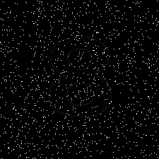
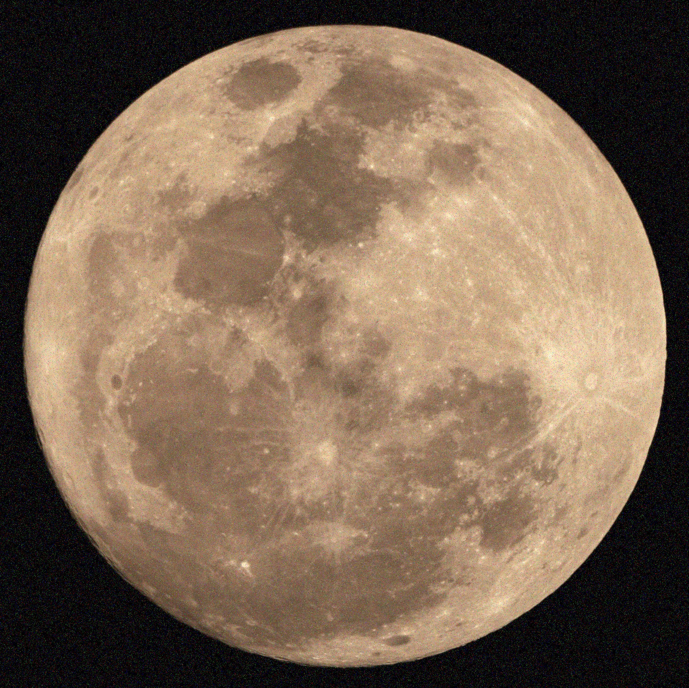
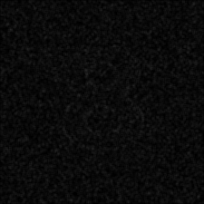
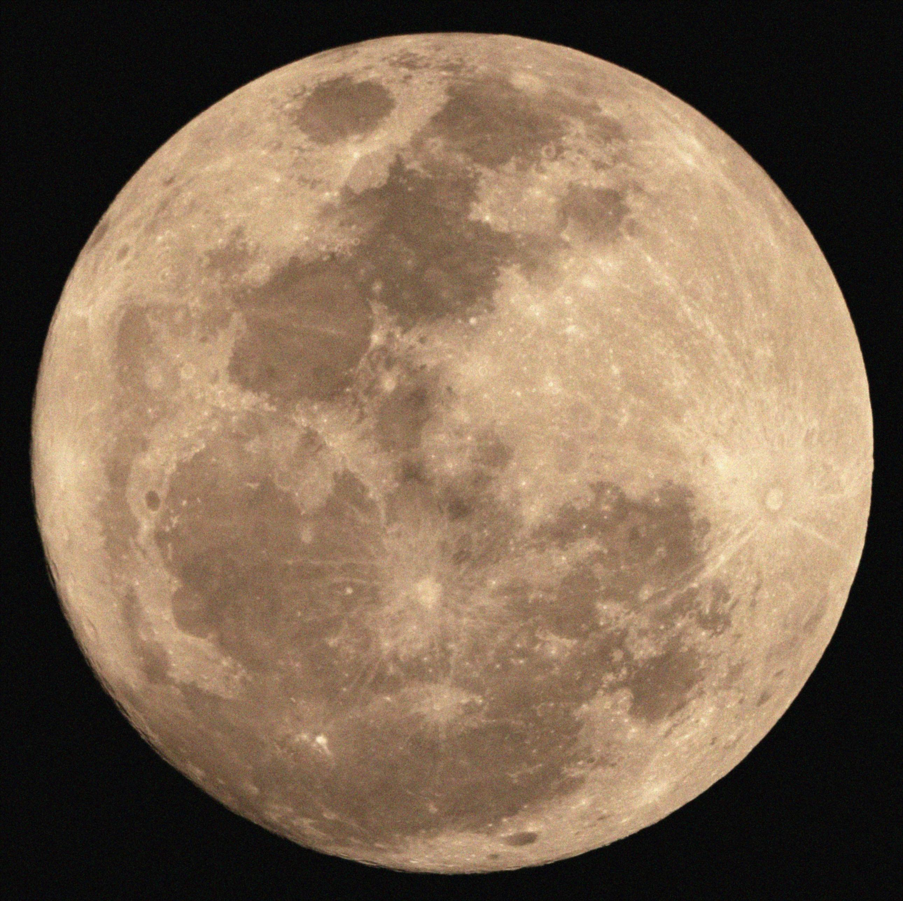
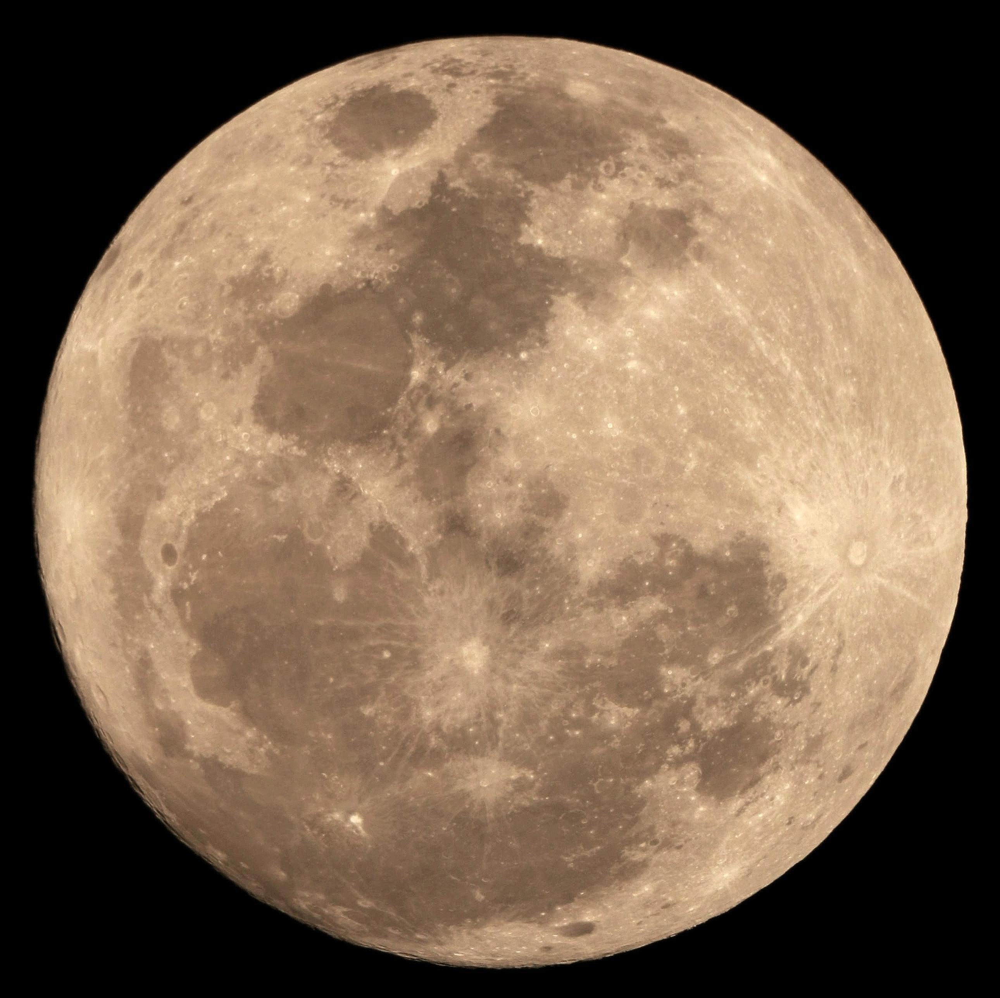
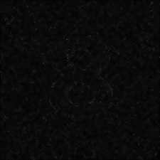
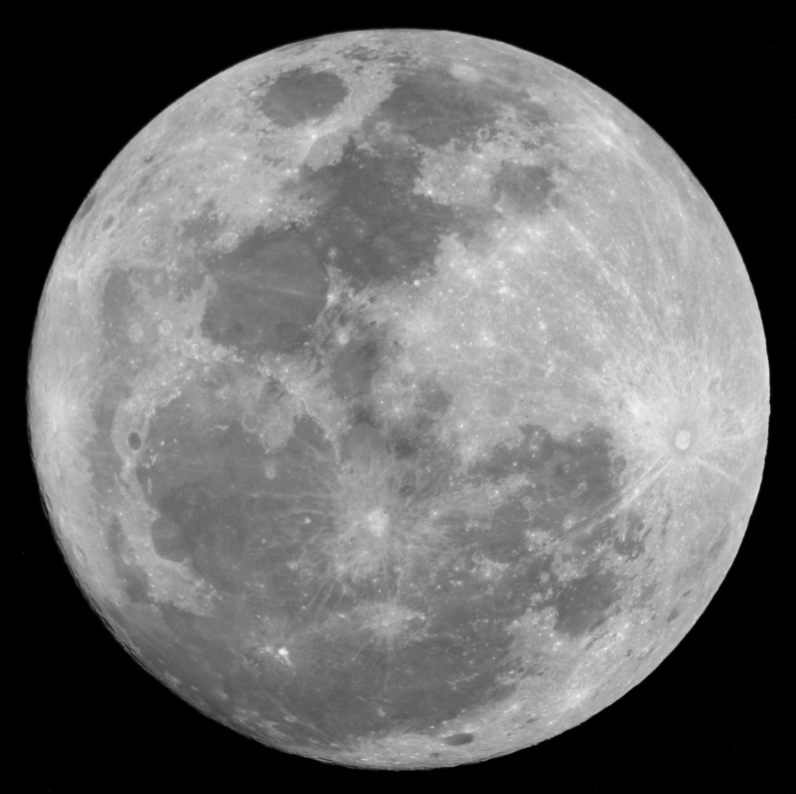

# Лабораторна робота №2
## Фільтрація й придушення шумів

---

## Мета роботи

Дослідити ефективність різних методів фільтрації зображень, спотворених шумами різних типів, та навчитися застосовувати інструменти обробки зображень у MATLAB.

---

## Теоретичні відомості

Під час обробки цифрових зображень часто виникає необхідність усунення шумів.  
Шуми можуть з'являтися під час зйомки, передавання сигналу або збереження даних.

Для моделювання шумів у MATLAB використовується функція:

```matlab
imnoise(I, type, parameters)
```

Основні типи шумів:
- **Gaussian** — гаусівський шум
- **Salt & Pepper** — імпульсний шум
- **Poisson** — пуасонівський шум

Для зменшення шуму використовують різні методи фільтрації.

---

## Структура файлів проєкту

- [Папка із вхідними зображеннями](images/)
- [Папка з результатами обробки](results/)
- [MATLAB-скрипт](script.m)

---

## Вхідні зображення

### Eight.png
[Відкрити файл](images/Eight.png)


### Moon.jpg
[Відкрити файл](images/Moon.jpg)


---

## Виконання роботи

### 1. Завантаження зображень

Було використано два тестових зображення:
- `Eight.png`
- `Moon.jpg`

```matlab
I1 = imread([input_folder 'Eight.png']);
I2 = imread([input_folder 'Moon.jpg']);
```

---

### 2. Додавання гаусівського шуму

```matlab
gauss1 = imnoise(I1,'gaussian',0,0.01);
gauss2 = imnoise(I2,'gaussian',0,0.01);
```

У результаті було отримано зашумлені зображення.

**Результати:**
- [gaussian_eight.png](results/gaussian_eight.png)
- [gaussian_moon.jpg](results/gaussian_moon.jpg)





---

### 3. Додавання імпульсного шуму

```matlab
sp1 = imnoise(I1,'salt & pepper',0.05);
sp2 = imnoise(I2,'salt & pepper',0.05);
```

Шум типу salt & pepper проявляється у вигляді випадкових чорних та білих пікселів.

**Результати:**
- [sp_eight.png](results/sp_eight.png)
- [sp_moon.jpg](results/sp_moon.jpg)





---

### 4. Низькочастотна фільтрація

Низькочастотний фільтр згладжує зображення та зменшує рівень шуму.

```matlab
h_low = ones(3,3)/9;
low1 = imfilter(gauss1,h_low);
low2 = imfilter(gauss2,h_low);
```

Після фільтрації шум зменшився, але зображення стало трохи розмитим.

**Результати:**
- [lowpass_eight.png](results/lowpass_eight.png)
- [lowpass_moon.jpg](results/lowpass_moon.jpg)





---

### 5. Високочастотна фільтрація

Високочастотний фільтр підсилює контури та різкі переходи яскравості.

```matlab
h_high = [0 -1 0;
          -1 5 -1;
          0 -1 0];

high1 = imfilter(I1,h_high);
high2 = imfilter(I2,h_high);
```

Після фільтрації контури об'єктів стали більш чіткими.

**Результати:**
- [highpass_eight.png](results/highpass_eight.png)
- [highpass_moon.jpg](results/highpass_moon.jpg)




---

### 6. Адаптивна вінерівська фільтрація

Фільтр Вінера автоматично підлаштовується під локальні характеристики шуму.

```matlab
wiener1 = wiener2(gauss1_gray,[5 5]);
wiener2_img = wiener2(gauss2_gray,[5 5]);
```

Цей фільтр добре пригнічує гаусівський шум.

**Результати:**
- [wiener_eight.png](results/wiener_eight.png)
- [wiener_moon.jpg](results/wiener_moon.jpg)




---

### 7. Медіанна фільтрація

Медіанна фільтрація ефективна для імпульсних шумів.

```matlab
median1 = medfilt2(sp1);
median2 = medfilt2(sp2);
```

Вона видаляє випадкові пікселі шуму без значного розмиття зображення.

**Результати:**
- [median_eight.png](results/median_eight.png)
- [median_moon.jpg](results/median_moon.jpg)




---

### 8. Спеціальні фільтри

Для підсилення деталей було використано фільтр `unsharp`.

```matlab
h_unsharp = fspecial('unsharp');
sharp1 = imfilter(I1,h_unsharp);
sharp2 = imfilter(I2,h_unsharp);
```

Після обробки зображення стало більш різким.

**Результати:**
- [unsharp_eight.png](results/unsharp_eight.png)
- [unsharp_moon.jpg](results/unsharp_moon.jpg)


---

## Висновок

У ході лабораторної роботи було досліджено різні методи фільтрації зображень у MATLAB.

Було встановлено:
- низькочастотні фільтри добре зменшують шум, але знижують різкість;
- високочастотні фільтри підсилюють контури;
- медіанна фільтрація ефективна для імпульсного шуму;
- вінерівський фільтр добре працює з гаусівським шумом.

Отримані результати підтверджують, що вибір методу фільтрації залежить від типу шуму та характеристик зображення.
# Лабораторна робота №2
## Фільтрація й придушення шумів

---

## Мета роботи

Дослідити ефективність різних методів фільтрації зображень, спотворених шумами різних типів, та навчитися застосовувати інструменти обробки зображень у MATLAB.

---

## Теоретичні відомості

Під час обробки цифрових зображень часто виникає необхідність усунення шумів.  
Шуми можуть з'являтися під час зйомки, передавання сигналу або збереження даних.

Для моделювання шумів у MATLAB використовується функція:

```matlab
imnoise(I, type, parameters)
```

Основні типи шумів:
- **Gaussian** — гаусівський шум
- **Salt & Pepper** — імпульсний шум
- **Poisson** — пуасонівський шум

Для зменшення шуму використовують різні методи фільтрації.

---

## Структура файлів проєкту

- [Папка із вхідними зображеннями](images/)
- [Папка з результатами обробки](results/)
- [MATLAB-скрипт](script.m)

---

## Вхідні зображення

### Eight.png
[Відкрити файл](images/Eight.png)


### Moon.jpg
[Відкрити файл](images/Moon.jpg)


---

## Виконання роботи

### 1. Завантаження зображень

Було використано два тестових зображення:
- `Eight.png`
- `Moon.jpg`

```matlab
I1 = imread([input_folder 'Eight.png']);
I2 = imread([input_folder 'Moon.jpg']);
```

---

### 2. Додавання гаусівського шуму

```matlab
gauss1 = imnoise(I1,'gaussian',0,0.01);
gauss2 = imnoise(I2,'gaussian',0,0.01);
```

У результаті було отримано зашумлені зображення.

**Результати:**
- [gaussian_eight.png](results/gaussian_eight.png)
- [gaussian_moon.jpg](results/gaussian_moon.jpg)


---

### 3. Додавання імпульсного шуму

```matlab
sp1 = imnoise(I1,'salt & pepper',0.05);
sp2 = imnoise(I2,'salt & pepper',0.05);
```

Шум типу salt & pepper проявляється у вигляді випадкових чорних та білих пікселів.

**Результати:**
- [sp_eight.png](results/sp_eight.png)
- [sp_moon.jpg](results/sp_moon.jpg)


---

### 4. Низькочастотна фільтрація

Низькочастотний фільтр згладжує зображення та зменшує рівень шуму.

```matlab
h_low = ones(3,3)/9;
low1 = imfilter(gauss1,h_low);
low2 = imfilter(gauss2,h_low);
```

Після фільтрації шум зменшився, але зображення стало трохи розмитим.

**Результати:**
- [lowpass_eight.png](results/lowpass_eight.png)
- [lowpass_moon.jpg](results/lowpass_moon.jpg)


---

### 5. Високочастотна фільтрація

Високочастотний фільтр підсилює контури та різкі переходи яскравості.

```matlab
h_high = [0 -1 0;
          -1 5 -1;
          0 -1 0];

high1 = imfilter(I1,h_high);
high2 = imfilter(I2,h_high);
```

Після фільтрації контури об'єктів стали більш чіткими.

**Результати:**
- [highpass_eight.png](results/highpass_eight.png)
- [highpass_moon.jpg](results/highpass_moon.jpg)


---

### 6. Адаптивна вінерівська фільтрація

Фільтр Вінера автоматично підлаштовується під локальні характеристики шуму.

```matlab
wiener1 = wiener2(gauss1_gray,[5 5]);
wiener2_img = wiener2(gauss2_gray,[5 5]);
```

Цей фільтр добре пригнічує гаусівський шум.

**Результати:**
- [wiener_eight.png](results/wiener_eight.png)
- [wiener_moon.jpg](results/wiener_moon.jpg)


---

### 7. Медіанна фільтрація

Медіанна фільтрація ефективна для імпульсних шумів.

```matlab
median1 = medfilt2(sp1);
median2 = medfilt2(sp2);
```

Вона видаляє випадкові пікселі шуму без значного розмиття зображення.

**Результати:**
- [median_eight.png](results/median_eight.png)
- [median_moon.jpg](results/median_moon.jpg)


---

### 8. Спеціальні фільтри

Для підсилення деталей було використано фільтр `unsharp`.

```matlab
h_unsharp = fspecial('unsharp');
sharp1 = imfilter(I1,h_unsharp);
sharp2 = imfilter(I2,h_unsharp);
```

Після обробки зображення стало більш різким.

**Результати:**
- [unsharp_eight.png](results/unsharp_eight.png)
- [unsharp_moon.jpg](results/unsharp_moon.jpg)


---

## Висновок

У ході лабораторної роботи було досліджено різні методи фільтрації зображень у MATLAB.

Було встановлено:
- низькочастотні фільтри добре зменшують шум, але знижують різкість;
- високочастотні фільтри підсилюють контури;
- медіанна фільтрація ефективна для імпульсного шуму;
- вінерівський фільтр добре працює з гаусівським шумом.

Отримані результати підтверджують, що вибір методу фільтрації залежить від типу шуму та характеристик зображення.