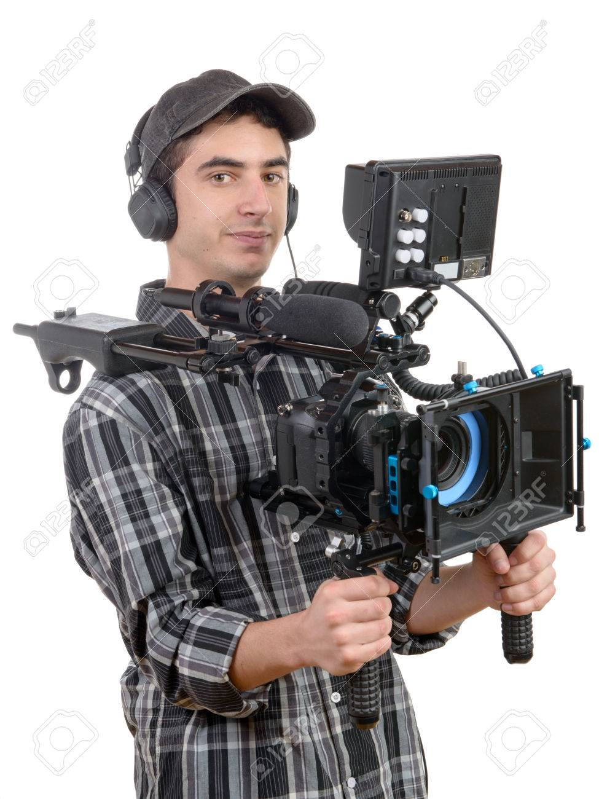
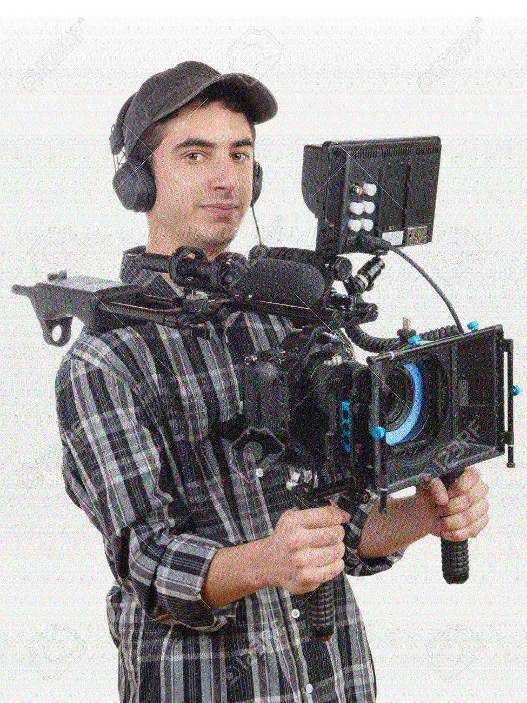
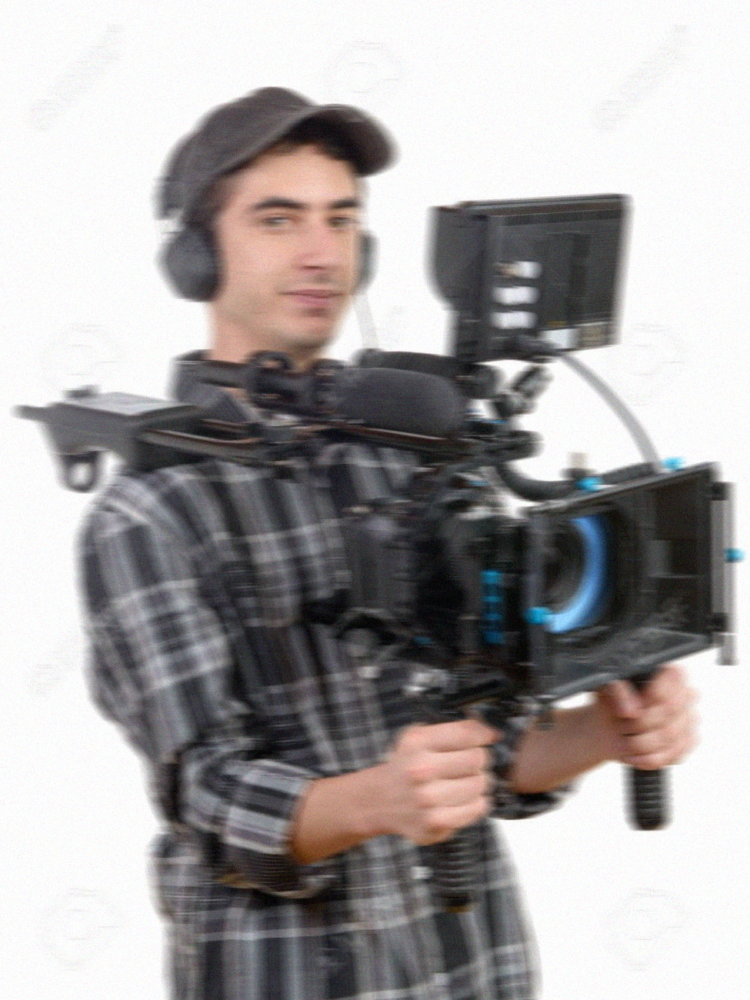
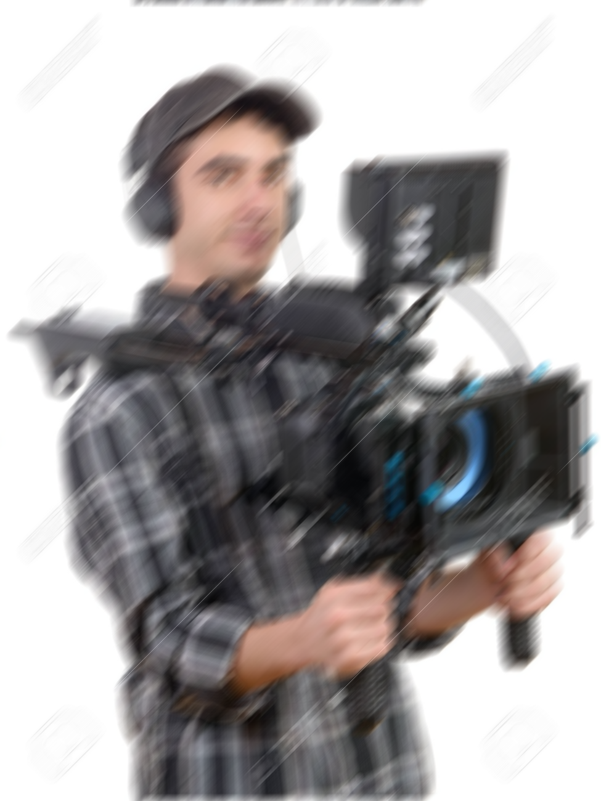

# Лабораторна робота №3
## Відновлення зображень

---

## Мета роботи

Дослідити методи відновлення перекручених зображень як за відсутності шуму, так і за його наявності.

---

## Теоретичні відомості

Модель формування зображення:

```text
s(x,y) = h(x,y) * u(x,y) + n(x,y)
```

де:
- `u(x,y)` — вихідне зображення
- `h(x,y)` — функція розмиття (PSF)
- `n(x,y)` — шум

---

## Структура файлів проєкту

- [Папка із вхідними зображеннями](images/)
- [Папка з результатами обробки](results/)
- [MATLAB-скрипт](script.m)

---

## Вхідне зображення

### Cameraman.jpg
[Відкрити файл](images/Cameraman.jpg)



---

## Хід роботи

### 1. Завантаження зображення

```matlab
I = imread([input_folder 'Cameraman.jpg']);

figure
imshow(I)
title('Вихідне зображення')
```

---

### 2. Розмиття (motion blur)

```matlab
LEN = 21;
THETA = 0;

PSF = fspecial('motion', LEN, THETA);
blurred = imfilter(I, PSF, 'conv', 'circular');
```

У цьому етапі до зображення застосовано розмиття руху. Функція `fspecial('motion', LEN, THETA)` створює функцію розмиття PSF з довжиною зміщення `LEN` і кутом руху `THETA`.

**Результат:**
- [blurred.png](results/blurred.png)


---

### 3. Відновлення без шуму

```matlab
restored = deconvwnr(blurred, PSF, 0);
```

Для відновлення використано вінерівську деконволюцію `deconvwnr()`. У цьому випадку параметр шуму дорівнює нулю, тобто розглядається ідеальний випадок без додаткового шуму.

**Результат:**
- [restored_no_noise.png](results/restored_no_noise.png)



---

### 4. Додавання шуму

```matlab
noisy = imnoise(blurred,'gaussian',0,0.001);
```

До змазаного зображення додається гаусівський шум, що моделює перешкоди, які можуть виникати під час зйомки або передавання сигналу.

**Результат:**
- [noisy_blurred.png](results/noisy_blurred.png)



---

### 5. Відновлення з шумом

```matlab
SNR = 0.01;
restored_noise = deconvwnr(noisy, PSF, SNR);
```

Після додавання шуму виконується повторне відновлення зображення. Якість результату вже нижча, ніж у випадку без шуму, оскільки шум впливає на точність деконволюції.

**Результат:**
- [restored_with_noise.png](results/restored_with_noise.png)


---

### 6. Експеримент зі зміною параметрів руху

```matlab
LEN2 = 35;
THETA2 = 45;

PSF2 = fspecial('motion', LEN2, THETA2);
blurred2 = imfilter(I, PSF2, 'conv','circular');
restored2 = deconvwnr(blurred2, PSF2, 0);
```

На цьому етапі параметри розмиття було змінено: збільшено довжину зміщення та змінено кут руху. Це дозволяє оцінити, як параметри PSF впливають на якість спотворення та подальшого відновлення.

**Результати:**
- [blurred_angle.png](results/blurred_angle.png)
- [restored_angle.png](results/restored_angle.png)




---

## Відповіді на питання

### Формування зображення

Зображення формується як згортка вихідного сигналу з функцією розмиття плюс шум.

### Модель

```text
s(x,y) = h(x,y) * u(x,y) + n(x,y)
```

### Відновлення

Для відновлення використовується деконволюція:

```matlab
deconvwnr()
```

---

## Висновок

Було досліджено методи відновлення зображень у MATLAB.  
У ході роботи отримано змазані зображення за допомогою моделі motion blur, після чого виконано їх відновлення методом Вінера.

Було встановлено, що:
- без шуму відновлення дає якісний результат;
- за наявності шуму якість відновленого зображення погіршується;
- правильний вибір параметрів функції розмиття суттєво впливає на результат;
- деконволюція є ефективним методом відновлення перекручених зображень.

Отримані результати підтверджують, що методи відновлення зображень залежать не лише від типу спотворення, а й від рівня шуму та точності задання функції розмиття.