# Лабораторна робота №4
## Просторові перетворення зображень

---

## Мета роботи

Дослідити застосування перетворення Фур'є для аналізу спектрів зображень та виконання фільтрації у частотній області.

---

## Теоретичні відомості

Двовимірне дискретне перетворення Фур'є (ДПФ) переводить зображення з просторової області в частотну:

```text
F(u,v) = fft2(f(x,y))
```

Зворотне перетворення:

```text
f(x,y) = ifft2(F(u,v))
```

Для відображення спектра використовують:

```text
S = log(1 + abs(F))
```

---

## Структура файлів проєкту

- [Папка із вхідними зображеннями](images/)
- [Папка з результатами обробки](results/)
- [MATLAB-скрипт](script.m)

---

## Вхідні зображення

### Cameraman.jpg
[Відкрити файл](images/Cameraman.jpg)


### Moon.jpg
[Відкрити файл](images/Moon.jpg)

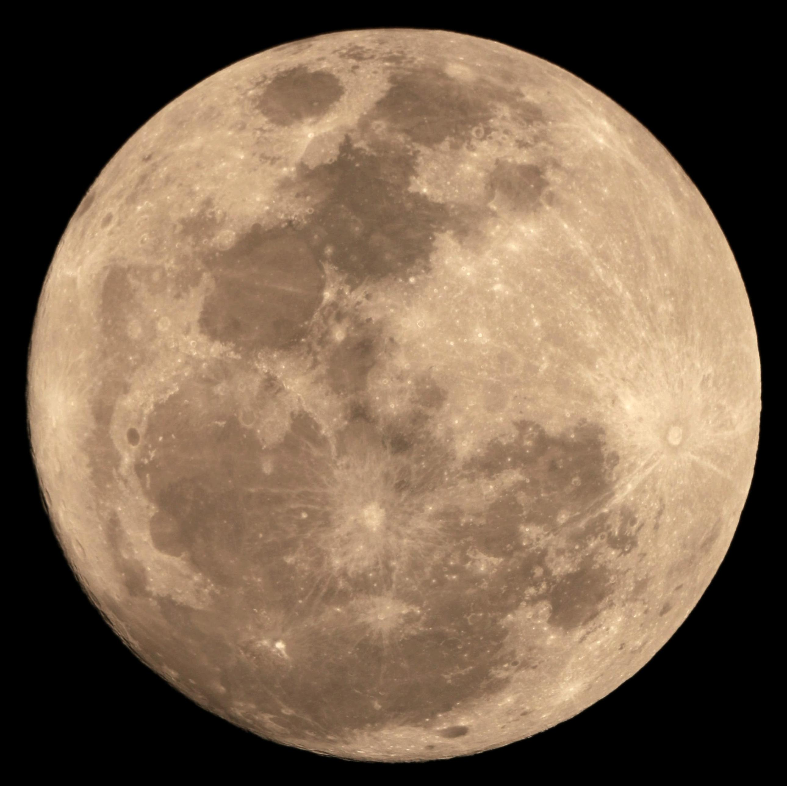

---

## Хід роботи

### 1. Завантаження зображень

```matlab
f1 = imread([input_folder 'Cameraman.jpg']);
f2 = imread([input_folder 'Moon.jpg']);
```

У роботі використано два зображення: `Cameraman.jpg` і `Moon.jpg`. Якщо зображення випадково є кольоровим, воно переводиться у відтінки сірого.

**Результати:**
- [original_cameraman.png](results/original_cameraman.png)
- [original_moon.png](results/original_moon.png)


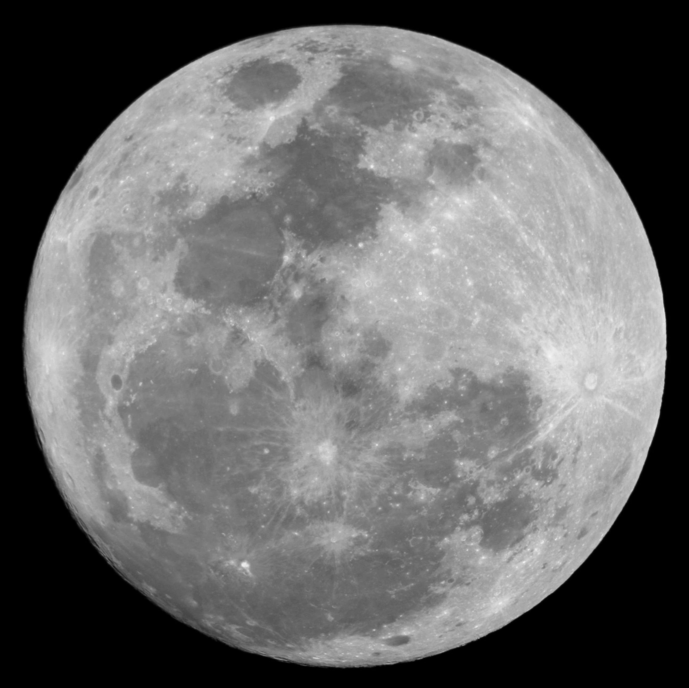

---

### 2. Обчислення спектра

```matlab
F1 = fft2(f1);
F2 = fft2(f2);

S1 = abs(F1);
S2 = abs(F2);

S1_log = log(1 + S1);
S2_log = log(1 + S2);
```

Функція `fft2()` виконує двовимірне дискретне перетворення Фур'є, переводячи зображення у частотну область. Логарифмічне масштабування використовується для кращої візуалізації спектра.

**Результати:**
- [spectrum_cameraman.png](results/spectrum_cameraman.png)
- [spectrum_moon.png](results/spectrum_moon.png)

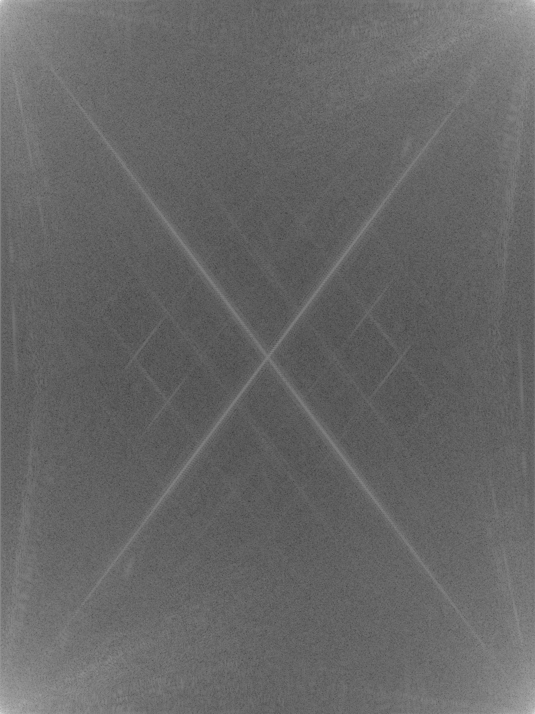

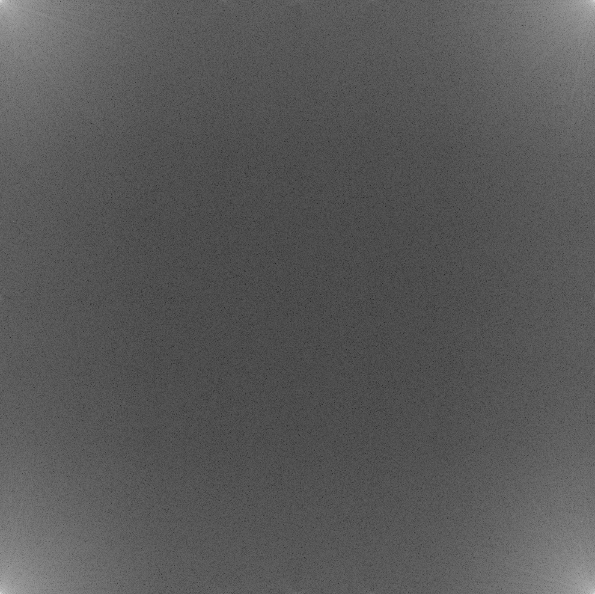

---

### 3. Центрування спектра

```matlab
F1_shift = fftshift(F1);
F2_shift = fftshift(F2);
```

Функція `fftshift()` переміщує нульову частоту в центр спектра, що робить аналіз частотних складових більш зручним.

**Результати:**
- [spectrum_shift_cameraman.png](results/spectrum_shift_cameraman.png)
- [spectrum_shift_moon.png](results/spectrum_shift_moon.png)

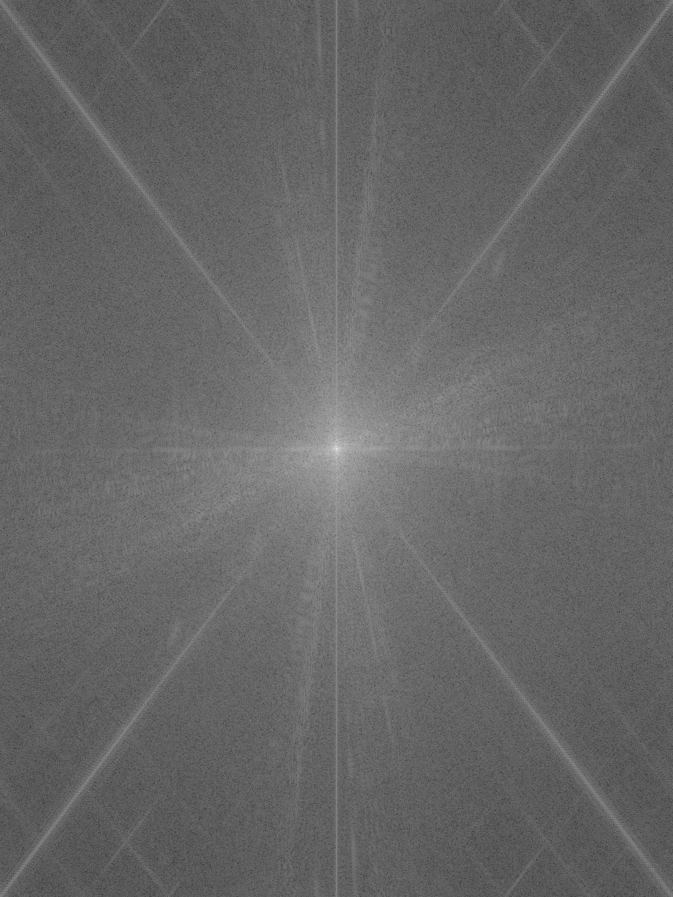

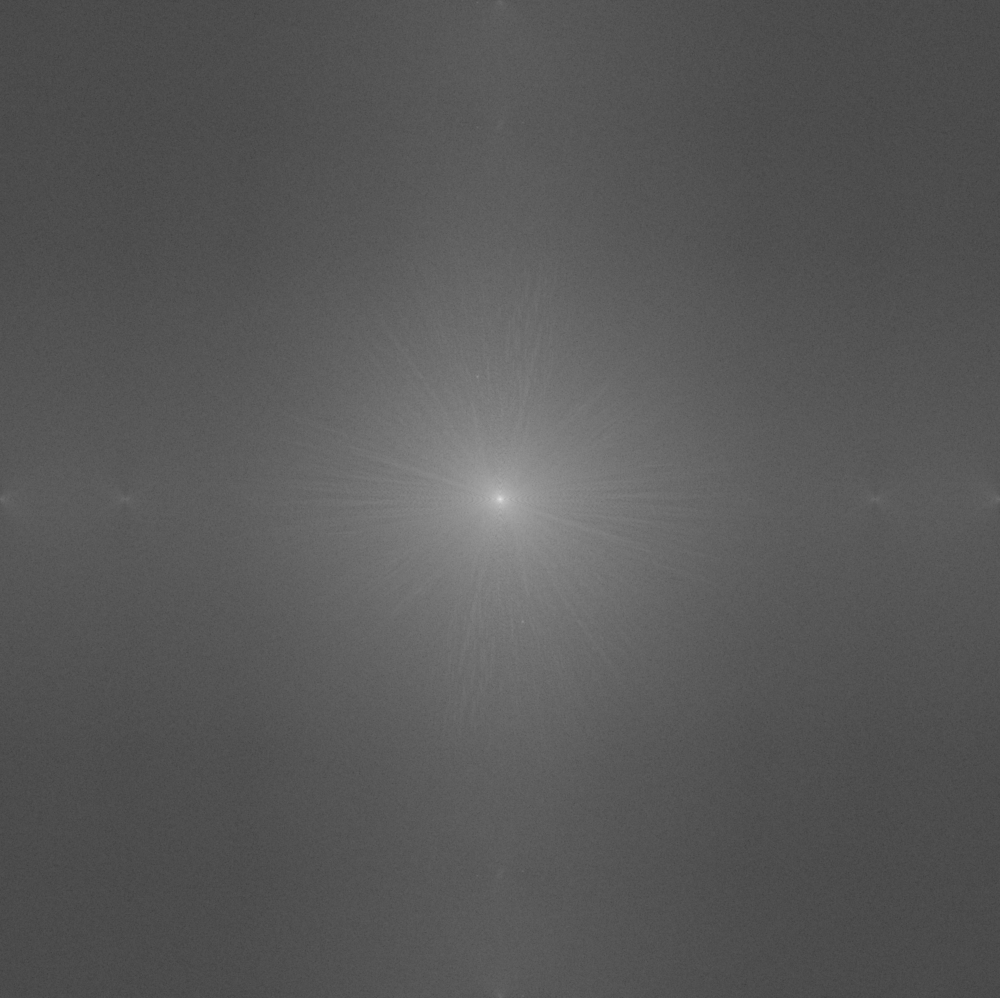

---

### 4. Відновлення зображення

```matlab
f1_ifft = ifft2(F1);
f2_ifft = ifft2(F2);

F1_unshift = ifftshift(F1_shift);
F2_unshift = ifftshift(F2_shift);

f1_ifft_shift = ifft2(F1_unshift);
f2_ifft_shift = ifft2(F2_unshift);
```

Функція `ifft2()` виконує зворотне перетворення Фур'є та відновлює зображення зі спектра. Додатково показано відновлення після комбінації `fftshift()` і `ifftshift()`.

**Результати:**
- [restored_ifft_cameraman.png](results/restored_ifft_cameraman.png)
- [restored_ifft_moon.png](results/restored_ifft_moon.png)
- [restored_shift_ifft_cameraman.png](results/restored_shift_ifft_cameraman.png)
- [restored_shift_ifft_moon.png](results/restored_shift_ifft_moon.png)


---

### 5. Gaussian фільтр

```matlab
sigma1 = 1;
sigma2 = 5;

h1_small = fspecial('gaussian', [M1 N1], sigma1);
h1_large = fspecial('gaussian', [M1 N1], sigma2);
```

Було побудовано два гаусові фільтри з різними значеннями `sigma`. Параметр `sigma` визначає ступінь згладжування.

**Результати:**
- [gaussian_window_sigma1.png](results/gaussian_window_sigma1.png)
- [gaussian_window_sigma5.png](results/gaussian_window_sigma5.png)

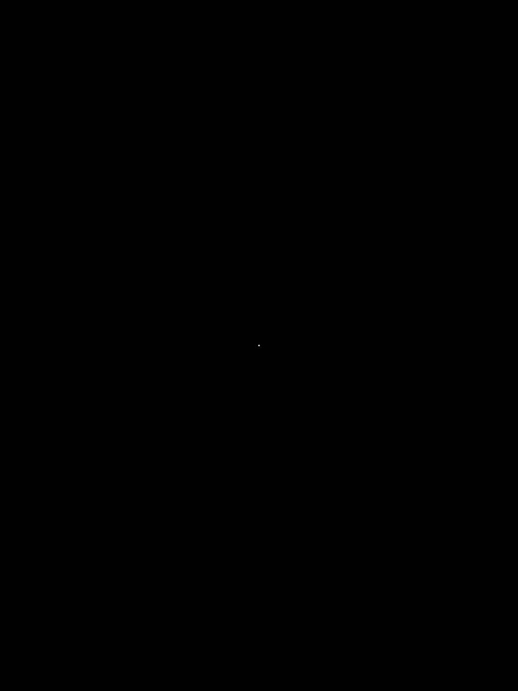


---

### 6. Частотна характеристика Gaussian фільтра

```matlab
H1_small = fft2(h1_small);
H1_large = fft2(h1_large);
```

Для кожного гаусового фільтра було отримано його частотну характеристику. Це дозволяє побачити, які частоти будуть пригнічуватися сильніше.

**Результати:**
- [gaussian_freq_sigma1.png](results/gaussian_freq_sigma1.png)
- [gaussian_freq_sigma5.png](results/gaussian_freq_sigma5.png)

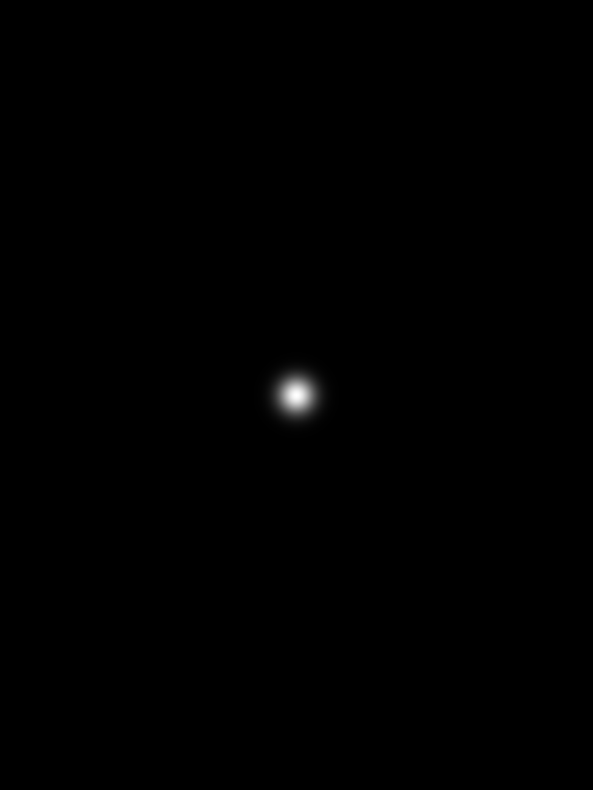


---

### 7. Фільтрація у частотній області

```matlab
IF_small = F1 .* H1_small;
IF_large = F1 .* H1_large;

filtered_freq_small = ifft2(IF_small);
filtered_freq_large = ifft2(IF_large);
```

Фільтрація виконується множенням спектра зображення на частотну характеристику фільтра, після чого застосовується зворотне перетворення `ifft2()`.

**Результати:**
- [filtered_freq_sigma1.png](results/filtered_freq_sigma1.png)
- [filtered_freq_sigma5.png](results/filtered_freq_sigma5.png)
- [moon_filtered_freq_sigma1.png](results/moon_filtered_freq_sigma1.png)
- [moon_filtered_freq_sigma5.png](results/moon_filtered_freq_sigma5.png)


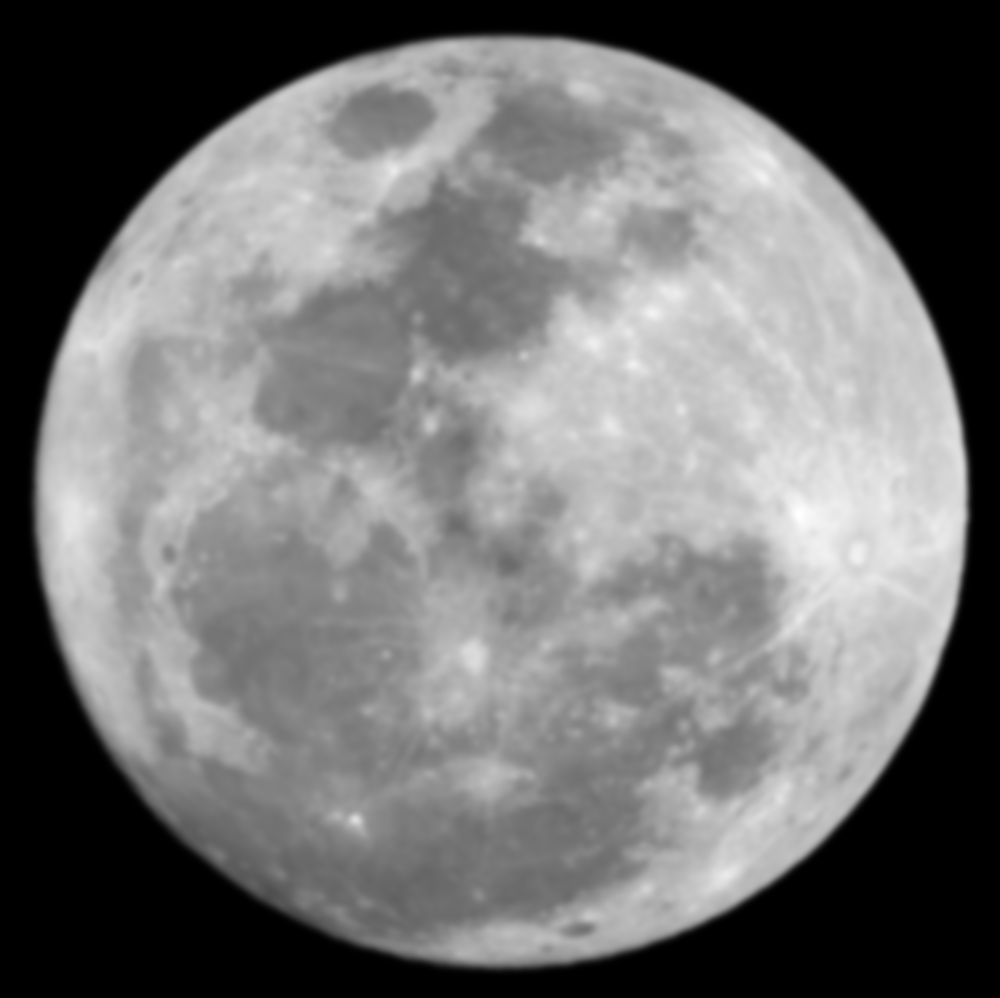

---

### 8. Спектри після фільтрації

```matlab
SIF_small = abs(IF_small);
SIF_large = abs(IF_large);

SIF_small_shift = fftshift(SIF_small);
SIF_large_shift = fftshift(SIF_large);
```

Було побудовано спектри після фільтрації для оцінки того, як Gaussian-фільтр впливає на високочастотні складові зображення.

**Результати:**
- [filtered_spectrum_sigma1.png](results/filtered_spectrum_sigma1.png)
- [filtered_spectrum_sigma5.png](results/filtered_spectrum_sigma5.png)

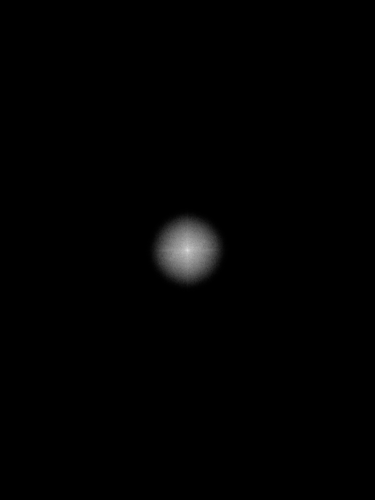

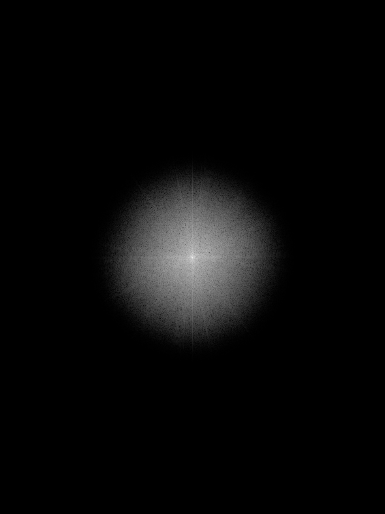

---

### 9. Фільтрація у просторовій області

```matlab
h_spatial_sigma1 = fspecial('gaussian', [15 15], sigma1);
h_spatial_sigma5 = fspecial('gaussian', [15 15], sigma2);

filtered_spatial_sigma1 = imfilter(f1, h_spatial_sigma1, 'replicate');
filtered_spatial_sigma5 = imfilter(f1, h_spatial_sigma5, 'replicate');
```

Для порівняння виконано згладжування у просторовій області за допомогою `imfilter()`. Результати можна порівняти з частотною фільтрацією.

**Результати:**
- [filtered_spatial_sigma1.png](results/filtered_spatial_sigma1.png)
- [filtered_spatial_sigma5.png](results/filtered_spatial_sigma5.png)


---

## Відповіді на питання

### Що робить `fft2`

Перетворює зображення у частотну область.

### Що робить `fftshift`

Переміщує нульову частоту в центр спектра.

### Що робить `ifft2`

Відновлює зображення зі спектра.

### Як впливає `sigma`

- малий `sigma` → слабке згладжування
- великий `sigma` → сильне згладжування

---

## Висновок

Було досліджено спектральне представлення зображень і застосування двовимірного перетворення Фур'є в MATLAB.  
У ході роботи було побудовано спектри зображень, виконано центрування нульової частоти, відновлення зображень та фільтрацію у частотній і просторовій областях.

Було встановлено, що:
- низькі частоти відповідають загальній структурі зображення;
- високі частоти відповідають дрібним деталям і контурам;
- Gaussian-фільтр пригнічує високочастотні складові;
- частотна фільтрація є ефективною та дає результати, близькі до просторової фільтрації.

Отримані результати підтверджують, що перетворення Фур'є є важливим інструментом аналізу та обробки цифрових зображень.