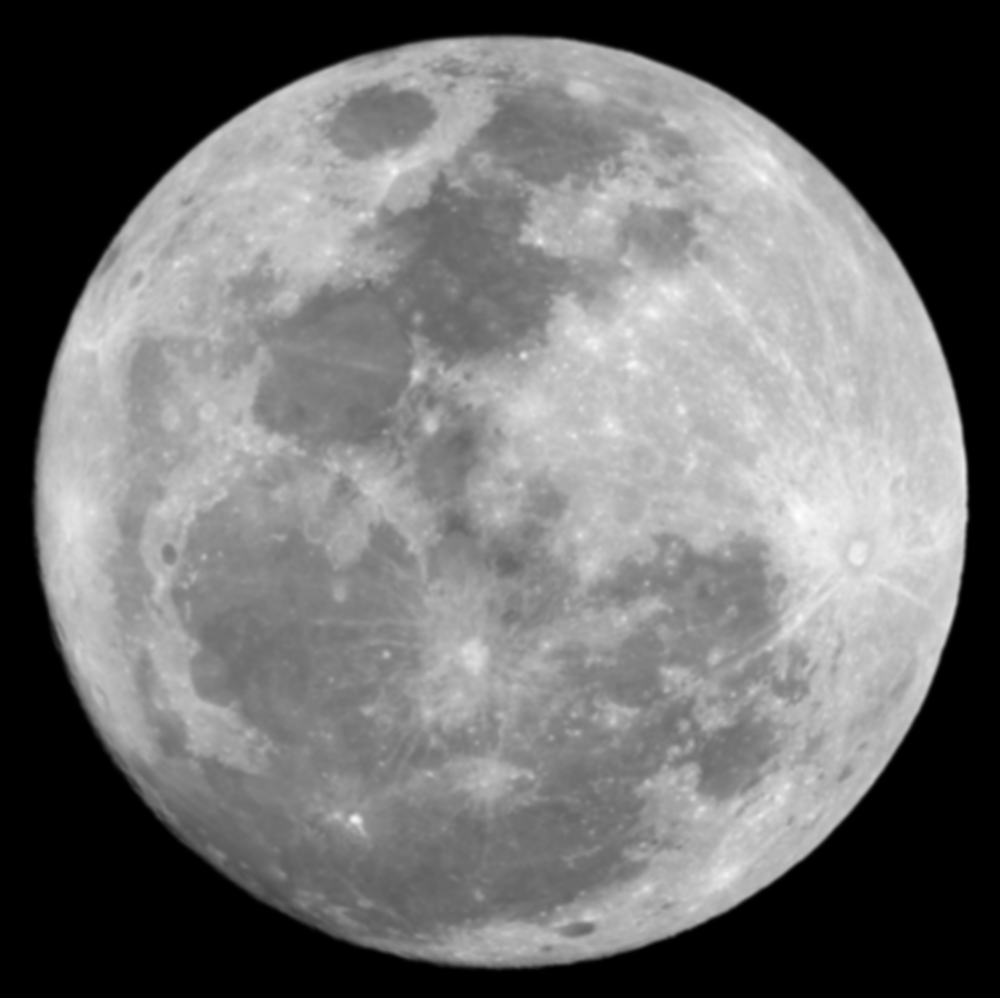

# Лабораторна робота №4
## Просторові перетворення зображень

---

## Мета роботи

Дослідити застосування перетворення Фур’є для аналізу спектрів зображень та виконання фільтрації у частотній області.

---

## Теоретичні відомості

Двовимірне дискретне перетворення Фур’є (ДПФ) переводить зображення з просторової області в частотну:

```text
F(u,v) = fft2(f(x,y))
```

Зворотне перетворення:

```text
f(x,y) = ifft2(F(u,v))
```

Для відображення спектра використовують:

```text
S = log(1 + abs(F))
```

Для правильної фільтрації у частотній області просторове ядро Gaussian-фільтра доцільно переводити у частотну характеристику за допомогою `psf2otf()`. Це дозволяє отримати коректне цілісне зображення після зворотного перетворення `ifft2()`.

---

## Структура файлів проєкту

- [Папка із вхідними зображеннями](images/)
- [Папка з результатами обробки](results/)
- [MATLAB-скрипт](script.m)

---

## Вхідні зображення

### Cameraman.jpg
[Відкрити файл](images/Cameraman.jpg)


### Moon.jpg
[Відкрити файл](images/Moon.jpg)


---

## Хід роботи

### 1. Завантаження зображень

```matlab
f1 = imread([input_folder 'Cameraman.jpg']);
f2 = imread([input_folder 'Moon.jpg']);
```

Було використано два тестові зображення: `Cameraman.jpg` і `Moon.jpg`. Якщо зображення кольорове, воно переводиться у відтінки сірого.

**Результати:**
- [original_cameraman.png](results/original_cameraman.png)
- [original_moon.png](results/original_moon.png)


---

### 2. Обчислення спектра

```matlab
F1 = fft2(double(f1));
F2 = fft2(double(f2));

S1 = abs(F1);
S2 = abs(F2);

S1_log = log(1 + S1);
S2_log = log(1 + S2);
```

Функція `fft2()` виконує двовимірне дискретне перетворення Фур’є, переводячи зображення у частотну область. Для кращої візуалізації використано логарифмічне масштабування.

**Результати:**
- [spectrum_cameraman.png](results/spectrum_cameraman.png)
- [spectrum_moon.png](results/spectrum_moon.png)


---

### 3. Центрування спектра

```matlab
F1_shift = fftshift(F1);
F2_shift = fftshift(F2);
```

Функція `fftshift()` переміщує нульову частоту в центр спектра, що полегшує аналіз низьких і високих частот.

**Результати:**
- [spectrum_shift_cameraman.png](results/spectrum_shift_cameraman.png)
- [spectrum_shift_moon.png](results/spectrum_shift_moon.png)


---

### 4. Відновлення зображення зі спектра

```matlab
f1_ifft = ifft2(F1);
f2_ifft = ifft2(F2);
```

За допомогою `ifft2()` виконується зворотне перетворення Фур’є та відновлення початкового зображення зі спектра.

Також було перевірено відновлення після комбінації `fftshift()` і `ifftshift()`:

```matlab
F1_unshift = ifftshift(F1_shift);
F2_unshift = ifftshift(F2_shift);

f1_ifft_shift = ifft2(F1_unshift);
f2_ifft_shift = ifft2(F2_unshift);
```

**Результати:**
- [restored_ifft_cameraman.png](results/restored_ifft_cameraman.png)
- [restored_ifft_moon.png](results/restored_ifft_moon.png)
- [restored_shift_ifft_cameraman.png](results/restored_shift_ifft_cameraman.png)
- [restored_shift_ifft_moon.png](results/restored_shift_ifft_moon.png)


---

### 5. Gaussian-фільтр

```matlab
sigma1 = 1;
sigma2 = 5;

h_small = fspecial('gaussian', [15 15], sigma1);
h_large = fspecial('gaussian', [15 15], sigma2);
```

Було сформовано два Gaussian-фільтри з різними параметрами `sigma`. При меншому значенні `sigma` згладжування слабше, при більшому — сильніше.

---

### 6. Частотна характеристика Gaussian-фільтра

```matlab
H1_small = psf2otf(h_small, size(f1));
H1_large = psf2otf(h_large, size(f1));

H2_small = psf2otf(h_small, size(f2));
H2_large = psf2otf(h_large, size(f2));
```

Функція `psf2otf()` коректно переводить просторове ядро в частотну область, тому результати фільтрації в 7 пункті мають вигляд цілісних згладжених зображень.

**Результати:**
- [gaussian_freq_sigma1.png](results/gaussian_freq_sigma1.png)
- [gaussian_freq_sigma5.png](results/gaussian_freq_sigma5.png)


---

### 7. Фільтрація у частотній області

```matlab
IF1_small = F1 .* H1_small;
IF1_large = F1 .* H1_large;

IF2_small = F2 .* H2_small;
IF2_large = F2 .* H2_large;

filtered_freq1_small = real(ifft2(IF1_small));
filtered_freq1_large = real(ifft2(IF1_large));

filtered_freq2_small = real(ifft2(IF2_small));
filtered_freq2_large = real(ifft2(IF2_large));
```

Фільтрація виконується множенням спектра зображення на частотну характеристику фільтра, після чого застосовується зворотне перетворення `ifft2()`. У результаті отримуються цілісні згладжені зображення.

**Результати:**
- [filtered_freq_sigma1.png](results/filtered_freq_sigma1.png)
- [filtered_freq_sigma5.png](results/filtered_freq_sigma5.png)
- [moon_filtered_freq_sigma1.png](results/moon_filtered_freq_sigma1.png)
- [moon_filtered_freq_sigma5.png](results/moon_filtered_freq_sigma5.png)


---

### 8. Спектри після фільтрації

```matlab
SIF1_small = abs(IF1_small);
SIF1_large = abs(IF1_large);

SIF1_small_shift = fftshift(SIF1_small);
SIF1_large_shift = fftshift(SIF1_large);
```

Було побудовано спектри після частотної фільтрації для оцінки змін у високочастотних складових зображення.

**Результати:**
- [filtered_spectrum_sigma1.png](results/filtered_spectrum_sigma1.png)
- [filtered_spectrum_sigma5.png](results/filtered_spectrum_sigma5.png)


---

### 9. Фільтрація у просторовій області

```matlab
filtered_spatial_sigma1 = imfilter(double(f1), h_small, 'replicate');
filtered_spatial_sigma5 = imfilter(double(f1), h_large, 'replicate');
```

Для порівняння було виконано згладжування першого зображення у просторовій області. Результати мають бути близькими до фільтрації у частотній області.

**Результати:**
- [filtered_spatial_sigma1.png](results/filtered_spatial_sigma1.png)
- [filtered_spatial_sigma5.png](results/filtered_spatial_sigma5.png)


---

### 10. Порівняння для другого зображення Moon у просторовій області

```matlab
filtered2_spatial_sigma1 = imfilter(double(f2), h_small, 'replicate');
filtered2_spatial_sigma5 = imfilter(double(f2), h_large, 'replicate');
```

Аналогічно виконано просторову фільтрацію для другого зображення `Moon.jpg`.

**Результати:**
- [moon_filtered_spatial_sigma1.png](results/moon_filtered_spatial_sigma1.png)
- [moon_filtered_spatial_sigma5.png](results/moon_filtered_spatial_sigma5.png)




---

## Відповіді на питання

### Що робить `fft2`

Перетворює зображення у частотну область.

### Що робить `fftshift`

Переміщує нульову частоту в центр спектра.

### Що робить `ifft2`

Відновлює зображення зі спектра.

### Для чого потрібен `psf2otf`

Коректно переводить просторове ядро фільтра у частотну область без зсувів, що важливо для правильної частотної фільтрації.

### Як впливає `sigma`

- малий `sigma` → слабке згладжування
- великий `sigma` → сильне згладжування

---

## Висновок

Було досліджено спектральне представлення зображень та застосування двовимірного перетворення Фур’є у MATLAB.

У ході роботи:
- побудовано спектри зображень;
- виконано центрування нульової частоти;
- відновлено зображення за спектром;
- досліджено Gaussian-фільтрацію у частотній області;
- виконано порівняння з просторовою фільтрацією для двох зображень.

Було встановлено, що:
- низькі частоти відповідають загальній структурі зображення;
- високі частоти відповідають деталям і контурам;
- Gaussian-фільтр пригнічує високочастотні складові;
- правильне використання `psf2otf()` забезпечує коректний результат у частотній області;
- результати частотної та просторової фільтрації є подібними.

Отримані результати підтверджують, що перетворення Фур’є є важливим інструментом аналізу та обробки цифрових зображень.
