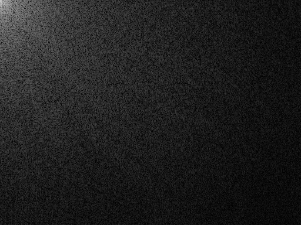
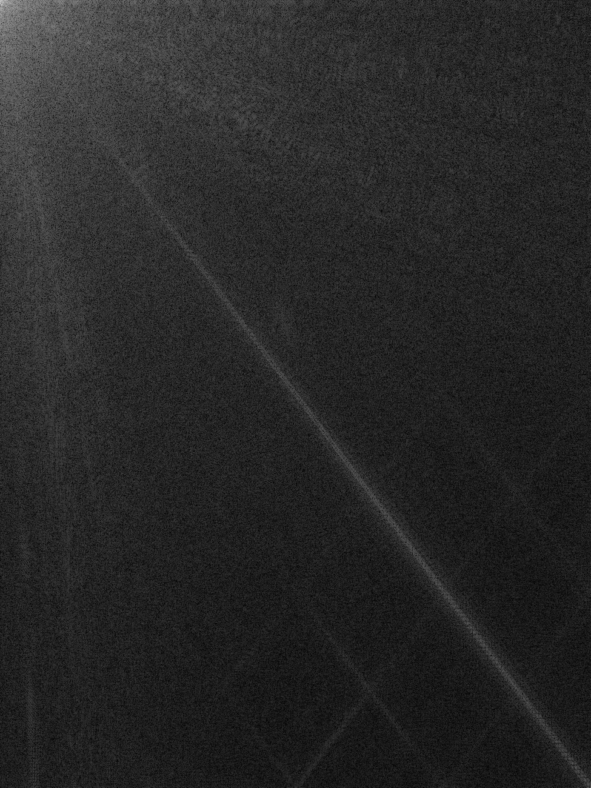
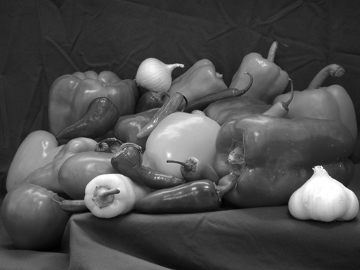
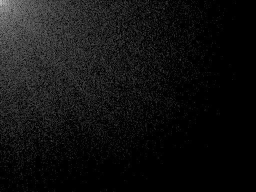
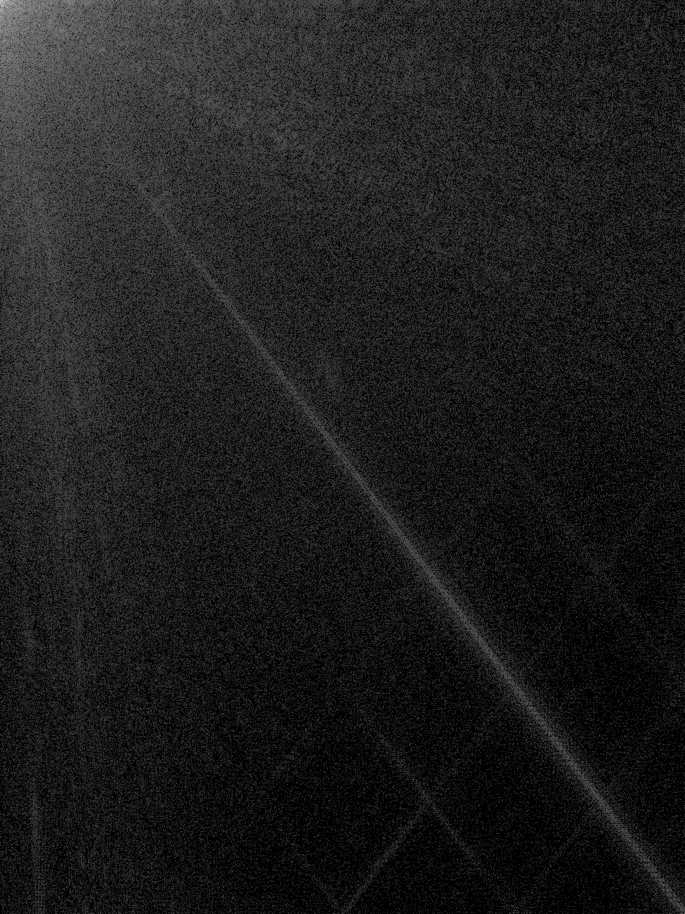
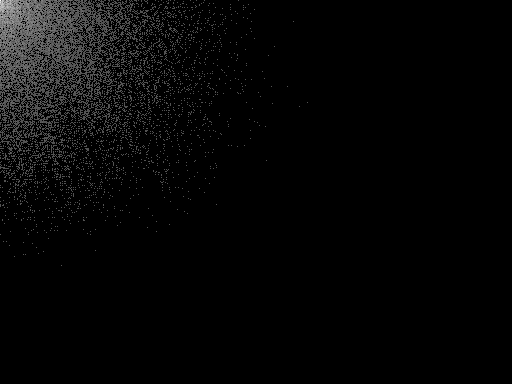
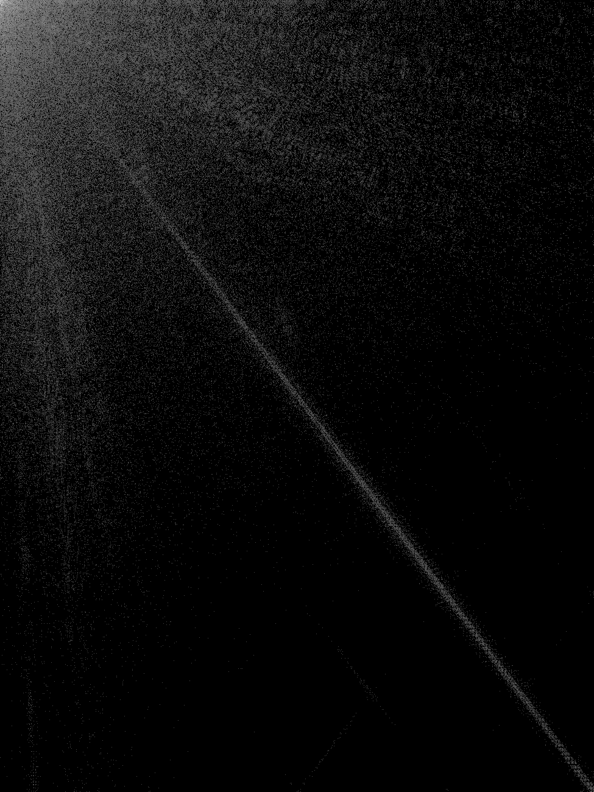
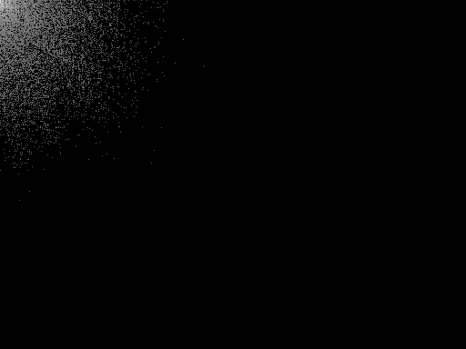
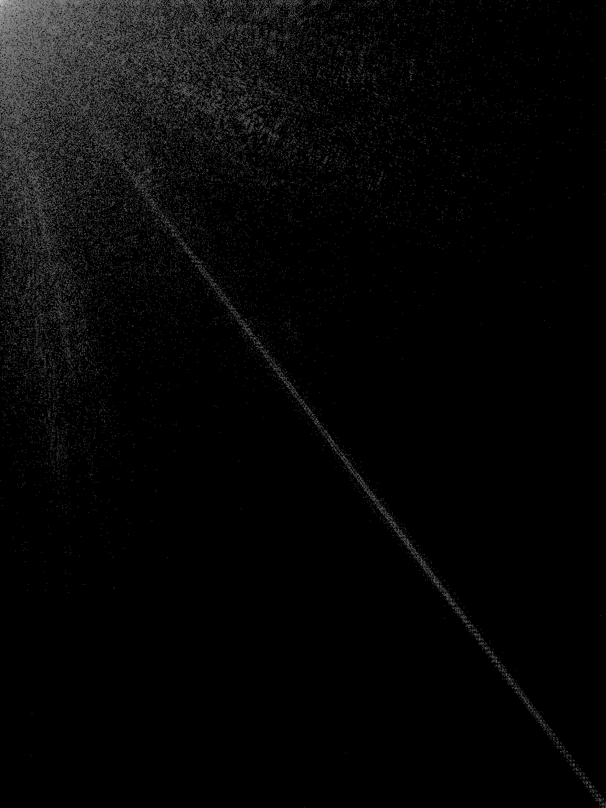

# Лабораторна робота №5
## Стиснення зображень

---

## Мета роботи

Ознайомитися з методами стиснення зображень та дослідити дискретне косинусне перетворення (DCT).

---

## Теоретичні відомості

Алгоритм JPEG базується на таких основних етапах:
1. Перетворення (**DCT**)
2. Квантування

DCT переводить зображення у частотну область:

```text
J = dct2(I)
```

Зворотне перетворення:

```text
I = idct2(J)
```

---

## Структура файлів проєкту

- [Папка із вхідними зображеннями](images/)
- [Папка з результатами обробки](results/)
- [MATLAB-скрипт](script.m)

---

## Вхідні зображення

### Peppers.png
[Відкрити файл](images/Peppers.png)


### Cameraman.png
[Відкрити файл](images/Cameraman.png)


---

## Хід роботи

### 1. Завантаження зображень

```matlab
img1 = imread([input_folder 'Peppers.png']);
img2 = imread([input_folder 'Cameraman.png']);
```

Було завантажено два тестові зображення для подальшого аналізу та стиснення.

---

### 2. Перетворення в grayscale

```matlab
if ndims(img1) == 3
    gray1 = rgb2gray(img1);
else
    gray1 = img1;
end

if ndims(img2) == 3
    gray2 = rgb2gray(img2);
else
    gray2 = img2;
end
```

Перед виконанням DCT зображення переводяться у відтінки сірого.

**Результати:**
- [gray1.png](results/gray1.png)
- [gray2.png](results/gray2.png)


---

### 3. Дискретне косинусне перетворення (DCT)

```matlab
J1 = dct2(gray1);
J2 = dct2(gray2);
```

Функція `dct2()` переводить зображення у частотну область. Для візуалізації коефіцієнтів використано логарифмічне масштабування.

**Результати:**
- [dct1.png](results/dct1.png)
- [dct2.png](results/dct2.png)





---

### 4. Відновлення без втрат

```matlab
rec1 = idct2(J1);
rec2 = idct2(J2);
```

Зворотне косинусне перетворення `idct2()` дозволяє відновити початкове зображення без втрати якості, якщо квантування не застосовується.

**Результати:**
- [reconstructed1.png](results/reconstructed1.png)
- [reconstructed2.png](results/reconstructed2.png)




---

### 5. Квантування коефіцієнтів DCT

```matlab
N_values = [10, 30, 50];

J1_q = N * round(J1 / N);
J2_q = N * round(J2 / N);
```

Квантування зменшує точність коефіцієнтів DCT, що дозволяє скоротити обсяг даних. У роботі досліджено три значення параметра `N`: 10, 30 і 50.

#### Для N = 10

**DCT після квантування:**
- [dct1_q_N10.png](results/dct1_q_N10.png)
- [dct2_q_N10.png](results/dct2_q_N10.png)





**Відновлені зображення:**
- [rec1_q_N10.png](results/rec1_q_N10.png)
- [rec2_q_N10.png](results/rec2_q_N10.png)


#### Для N = 30

**DCT після квантування:**
- [dct1_q_N30.png](results/dct1_q_N30.png)
- [dct2_q_N30.png](results/dct2_q_N30.png)





**Відновлені зображення:**
- [rec1_q_N30.png](results/rec1_q_N30.png)
- [rec2_q_N30.png](results/rec2_q_N30.png)


#### Для N = 50

**DCT після квантування:**
- [dct1_q_N50.png](results/dct1_q_N50.png)
- [dct2_q_N50.png](results/dct2_q_N50.png)





**Відновлені зображення:**
- [rec1_q_N50.png](results/rec1_q_N50.png)
- [rec2_q_N50.png](results/rec2_q_N50.png)


---

### 6. Квантування оригіналу для порівняння

```matlab
n = 20;

img1_q = round(double(gray1)/n)*n;
img2_q = round(double(gray2)/n)*n;
```

Для порівняння також було виконано пряме квантування самих зображень у просторовій області.

**Результати:**
- [orig_quant1.png](results/orig_quant1.png)
- [orig_quant2.png](results/orig_quant2.png)


---

## Відповіді на питання

### Що робить DCT

Перетворює зображення у частотну область.

### Навіщо квантування

Зменшує кількість даних, що дає змогу виконати стиснення.

### Чому JPEG ефективний

Тому що основна енергія зображення зосереджена у низьких частотах.

### Недоліки

При сильному стисненні з'являються втрати якості та артефакти.

---

## Висновок

Було досліджено метод стиснення зображень на основі дискретного косинусного перетворення.  
У ході роботи встановлено, що квантування дозволяє значно зменшити обсяг даних, але при збільшенні кроку квантування погіршується якість відновленого зображення.

Отримані результати підтверджують, що:
- DCT є основою JPEG-стиснення;
- найбільш важлива інформація міститься у низькочастотних коефіцієнтах;
- квантування забезпечує стиснення, але призводить до втрат;
- баланс між якістю та ступенем стиснення залежить від вибору параметра квантування.