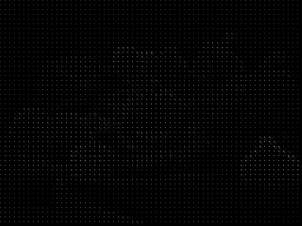
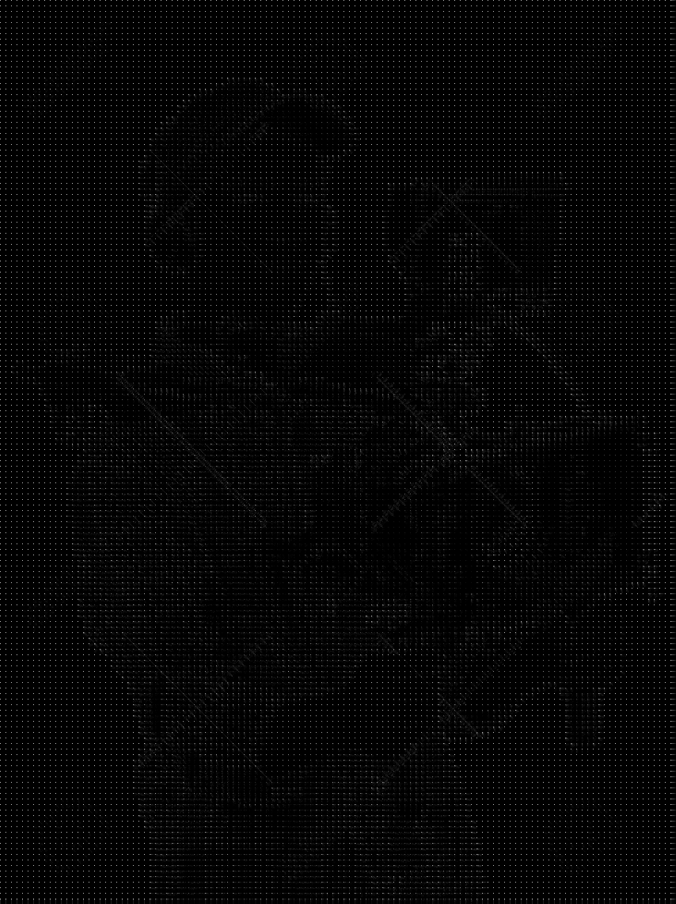
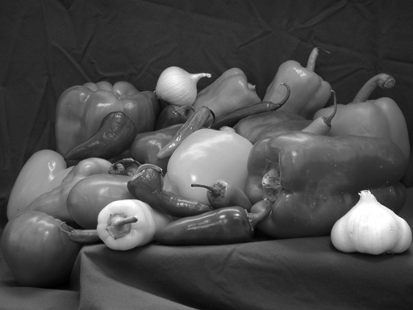
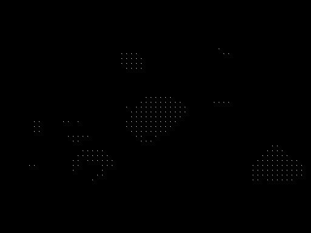
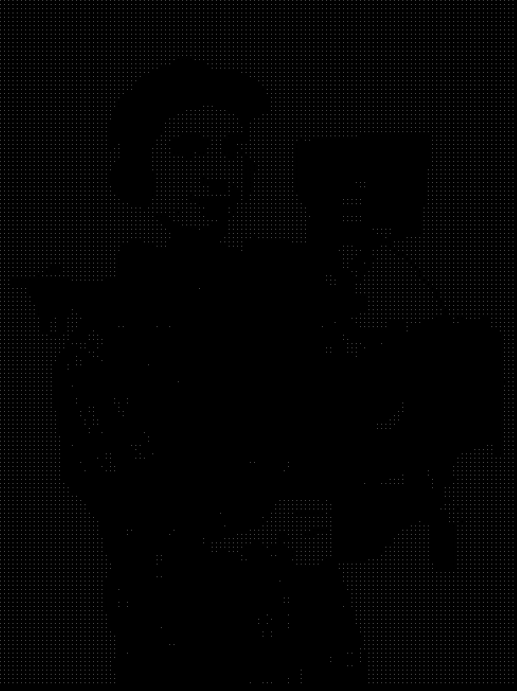
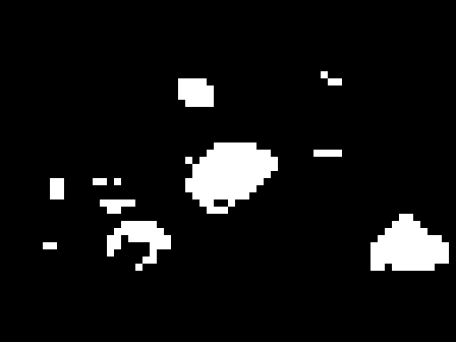
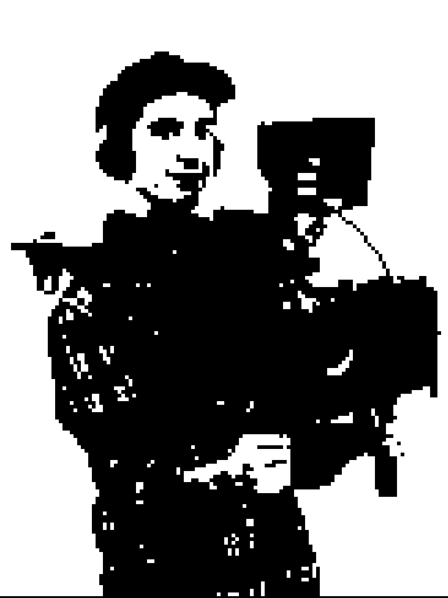
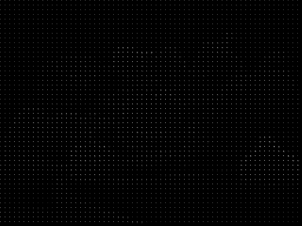
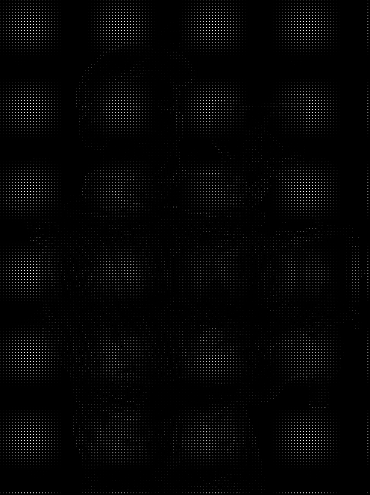
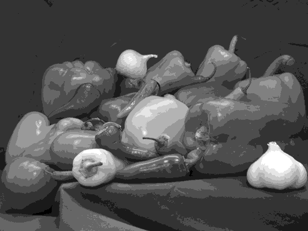

# Лабораторна робота №6
## Блокова обробка. Реалізація алгоритму JPEG

---

## Мета роботи

Дослідити блокову обробку зображень та реалізацію алгоритму JPEG на основі ДКП і квантування.

---

## Теоретичні відомості

Алгоритм JPEG складається з таких етапів:
1. Розбиття зображення на блоки `8x8`
2. Дискретне косинусне перетворення (**DCT**)
3. Квантування коефіцієнтів
4. Відновлення через **IDCT**

DCT:

```text
J = dct2(I)
```

Поблочний варіант:

```text
blockproc(I, [8 8], dct_fun)
```

---

## Структура файлів проєкту

- [Папка із вхідними зображеннями](images/)
- [Папка з результатами обробки](results/)
- [MATLAB-скрипт](script.m)

---

## Вхідні зображення

### Peppers.png
[Відкрити файл](images/Peppers.png)


### Cameraman.png
[Відкрити файл](images/Cameraman.png)


---

## Хід роботи

### 1. Завантаження зображень

```matlab
img1 = imread([input_folder 'Peppers.png']);
img2 = imread([input_folder 'Cameraman.png']);
```

Було завантажено два тестові зображення для реалізації JPEG-подібного стиснення.

---

### 2. Перетворення у grayscale

```matlab
if ndims(img1) == 3
    gray1 = rgb2gray(img1);
else
    gray1 = img1;
end

if ndims(img2) == 3
    gray2 = rgb2gray(img2);
else
    gray2 = img2;
end
```

Перед поблочною обробкою зображення переводяться у відтінки сірого.

**Результати:**
- [gray1.png](results/gray1.png)
- [gray2.png](results/gray2.png)


---

### 3. Переведення у формат `double`

```matlab
I1 = im2double(gray1);
I2 = im2double(gray2);
```

Це необхідно для коректного виконання математичних операцій під час DCT, квантування та відновлення.

---

### 4. Формування матриці DCT 8×8

```matlab
T = dctmtx(8);

dct_fun    = @(block_struct) T * block_struct.data * T';
invdct_fun = @(block_struct) T' * block_struct.data * T;
```

Матриця `dctmtx(8)` використовується для виконання дискретного косинусного перетворення по блоках `8x8`.

---

### 5. Поблочне DCT

```matlab
B1 = blockproc(I1, [8 8], dct_fun, 'PadPartialBlocks', true, 'PadMethod', 0);
B2 = blockproc(I2, [8 8], dct_fun, 'PadPartialBlocks', true, 'PadMethod', 0);
```

Функція `blockproc()` застосовує DCT окремо до кожного блока зображення.

**Результати:**
- [block_dct1.png](results/block_dct1.png)
- [block_dct2.png](results/block_dct2.png)





---

### 6. Відновлення без втрат

```matlab
R1 = blockproc(B1, [8 8], invdct_fun, 'PadPartialBlocks', true, 'PadMethod', 0);
R2 = blockproc(B2, [8 8], invdct_fun, 'PadPartialBlocks', true, 'PadMethod', 0);
```

Після застосування зворотного DCT відновлюється початкове зображення без втрат, якщо квантування не використовувалось.

**Результати:**
- [reconstructed1_no_quant.png](results/reconstructed1_no_quant.png)
- [reconstructed2_no_quant.png](results/reconstructed2_no_quant.png)




---

### 7. Просте квантування DCT-коефіцієнтів

```matlab
N_values = [10 20 40];

B1_q = N * round(B1 / N);
B2_q = N * round(B2 / N);
```

Було досліджено кілька значень параметра квантування: `10`, `20`, `40`. Чим більше значення `N`, тим сильніше стискаються дані, але тим більші втрати якості.

#### Для N = 10

**DCT після квантування:**
- [block_dct1_quant_N10.png](results/block_dct1_quant_N10.png)
- [block_dct2_quant_N10.png](results/block_dct2_quant_N10.png)





**Відновлені зображення:**
- [reconstructed1_quant_N10.png](results/reconstructed1_quant_N10.png)
- [reconstructed2_quant_N10.png](results/reconstructed2_quant_N10.png)





#### Для N = 20

**DCT після квантування:**
- [block_dct1_quant_N20.png](results/block_dct1_quant_N20.png)
- [block_dct2_quant_N20.png](results/block_dct2_quant_N20.png)


**Відновлені зображення:**
- [reconstructed1_quant_N20.png](results/reconstructed1_quant_N20.png)
- [reconstructed2_quant_N20.png](results/reconstructed2_quant_N20.png)


#### Для N = 40

**DCT після квантування:**
- [block_dct1_quant_N40.png](results/block_dct1_quant_N40.png)
- [block_dct2_quant_N40.png](results/block_dct2_quant_N40.png)


**Відновлені зображення:**
- [reconstructed1_quant_N40.png](results/reconstructed1_quant_N40.png)
- [reconstructed2_quant_N40.png](results/reconstructed2_quant_N40.png)


---

### 8. JPEG-подібна маска коефіцієнтів

```matlab
mask = [1 1 1 1 0 0 0 0;
        1 1 1 0 0 0 0 0;
        1 1 0 0 0 0 0 0;
        1 0 0 0 0 0 0 0;
        0 0 0 0 0 0 0 0;
        0 0 0 0 0 0 0 0;
        0 0 0 0 0 0 0 0;
        0 0 0 0 0 0 0 0];
```

Ця маска залишає переважно низькочастотні коефіцієнти, а високочастотні відсікає. Це наближує алгоритм до JPEG-підходу.

```matlab
mask_fun = @(block_struct) mask .* block_struct.data;
B1_masked = blockproc(B1, [8 8], mask_fun, 'PadPartialBlocks', true, 'PadMethod', 0);
B2_masked = blockproc(B2, [8 8], mask_fun, 'PadPartialBlocks', true, 'PadMethod', 0);
```

**Результати DCT після маски:**
- [block_dct1_masked.png](results/block_dct1_masked.png)
- [block_dct2_masked.png](results/block_dct2_masked.png)





**Відновлені зображення після маски:**
- [reconstructed1_masked.png](results/reconstructed1_masked.png)
- [reconstructed2_masked.png](results/reconstructed2_masked.png)


---

### 9. Квантування оригіналу для порівняння

```matlab
n = 0.1;
I1_q_orig = round(I1 / n) * n;
I2_q_orig = round(I2 / n) * n;
```

Для порівняння також виконано пряме квантування самих зображень у просторовій області.

**Результати:**
- [orig1_quant_direct.png](results/orig1_quant_direct.png)
- [orig2_quant_direct.png](results/orig2_quant_direct.png)




---

## Відповіді на питання

### Чому 8x8

Тому що це оптимальний баланс між ступенем стиснення, складністю обчислень і якістю відновленого зображення.

### Що дає блокова обробка

Дозволяє застосовувати перетворення окремо до невеликих ділянок зображення, що лежить в основі JPEG.

### Що робить квантування

Зменшує точність коефіцієнтів, що забезпечує стиснення даних.

### Чому важливі НЧ коефіцієнти

Низькочастотні коефіцієнти містять основну візуальну інформацію про зображення.

---

## Висновок

Було реалізовано спрощений JPEG-подібний алгоритм стиснення зображень.  
У ході роботи виконано поблочне DCT, зворотне відновлення, квантування коефіцієнтів та застосування маски для відсікання високочастотних складових.

Було встановлено, що:
- блокова обробка є основою алгоритму JPEG;
- квантування зменшує обсяг даних, але спричиняє втрати якості;
- відсікання високочастотних коефіцієнтів зберігає загальну структуру, але погіршує дрібні деталі;
- при сильному стисненні втрачаються текстури та зростає кількість артефактів.

Отримані результати підтверджують, що якість JPEG-стиснення визначається балансом між ступенем квантування та збереженням важливих коефіцієнтів DCT.